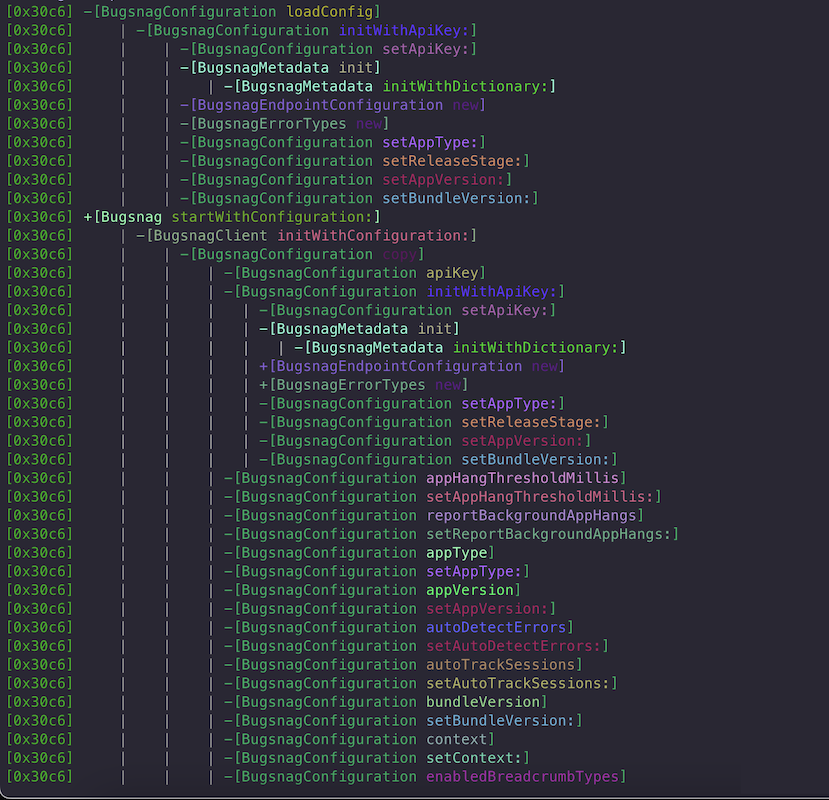
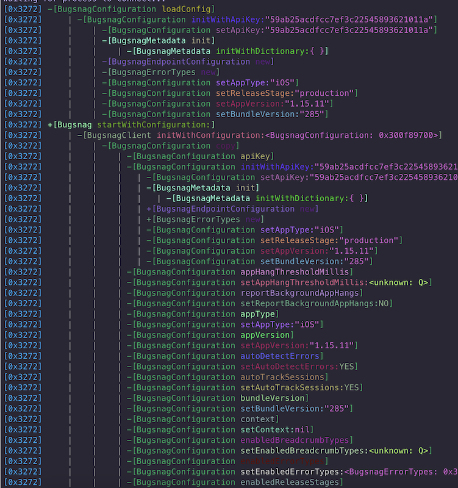
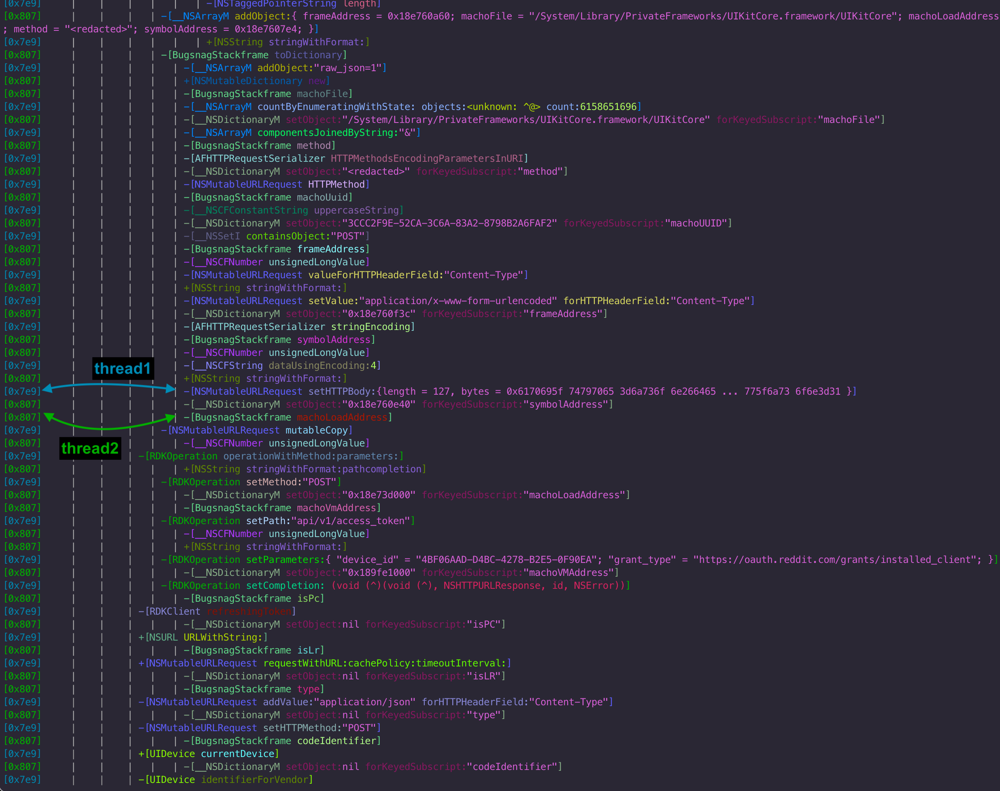

objsee is a command-line tool and library for inspecting Objective-C method calls at runtime through `objc_msgSend` tracing. It currently supports arm64 architectures.

### Features

- **CLI Utility** for quick usage, with TUI support.
- **Configurable Argument Detail** (from basic addresses to full `-description` strings).
- **Flexible Filtering** by class, method, and image/binary pattern.
- **Multiple Transports** for trace output: stdout, file, socket, or custom handlers.
- **Colorized Console Output** and optional JSON event output.


### CLI Usage

```bash
objsee [-h]            # Show help
       [-v]            # Show version
       [-T]            # TUI mode
       [-c <class>]    # Include classes
       [-C <class>]    # Exclude classes
       [-m <method>]   # Include methods
       [-M <method>]   # Exclude methods
       [-i <image>]    # Include images
       <bundle-id>
```

- **`-h`** : Show help.
- **`-v`** : Show version.
- **`-T`** : Run in TUI mode (thread-separated display).
- **`-c <pattern>`** : Include classes matching `pattern`.
- **`-C <pattern>`** : Exclude classes matching `pattern`.
- **`-m <pattern>`** : Include methods matching `pattern`.
- **`-M <pattern>`** : Exclude methods matching `pattern`.
- **`-i <pattern>`** : Include image paths matching `pattern`.
- **`<bundle-id>`** : The target application's bundle identifier (or process) to attach to.

> Patterns support wildcards (`*`). For example, `UIView*` will match `UIView`, `UIViewController`, etc.

### Common Usage Patterns

#### View Hierarchy Debugging
```bash
# Track view hierarchy changes
objsee -c "UIView*" -m "addSubview:*" -m "removeFromSuperview*" com.my.app
```

#### Network Monitoring
```bash
# Track network activity
objsee -c "NSURLSession*" -c "NSURLConnection*" com.my.app
```

#### Touch Tracking
```bash
# Monitor touch events
objsee -c "UI*" -m "touchesBegan:*" -m "touchesEnded:*" com.my.app
```

##### Example output:

```
[0x1234]-[__NSSingleObjectArrayI enumerateObjectsUsingBlock: (void (^)(void (^), BugsnagError, unknown, *))]
[0x1234]  | +[NSMutableDictionary new]
[0x1234]  | -[BugsnagError errorClass]
```

## Library Quick Start

Below is a minimal snippet to show how to integrate **objsee** into your own application or tooling.


```c
#include <objsee/tracer.h>
#include <stdio.h>

void event_handler(const tracer_event_t *event, void *context) {
    // Handle or log the event here
    // You can format it as JSON or colorized text, depending on tracer_format_options_t
    printf("Traced event: class=%s, method=%s\n", event->class_name, event->method_name);
}

int main() {
    tracer_error_t *error = NULL;
    tracer_t *tracer = tracer_create_with_error(&error);
    if (!tracer) {
        printf("Error creating tracer: %s\n", error->message);
        free_error(error);
        return 1;
    }
    
    // Configure format options
    tracer_format_options_t format = {
        .include_formatted_trace = true,
        .include_event_json = false,
        .output_as_json = false,
        .include_colors = true,
        .include_thread_id = true,
        .args = TRACER_ARG_FORMAT_DESCRIPTIVE,
        .include_indents = true,
        .include_indent_separators = true,
        .variable_separator_spacing = false,
        .static_separator_spacing = 4,
        .indent_char = ".",
        .indent_separator_char = "|",
        .include_newline_in_formatted_trace = true
    };
    tracer_set_format_options(tracer, format);
    
    // Output to custom handler
    tracer_set_output_handler(tracer, event_handler, NULL);
    // Or, send to stdout
    // tracer_set_output_stdout(tracer);

    // Add filters
    tracer_include_class(tracer, "UIView*");
    tracer_exclude_method(tracer, "dealloc");
    
    // Start tracing
    if (tracer_start(tracer) != TRACER_SUCCESS) {
        printf("Failed to start tracer: %s\n", tracer_get_last_error(tracer));
        tracer_cleanup(tracer);
        return 1;
    }

    // ... run your app logic or test code ...

    // Stop & cleanup
    tracer_stop(tracer);
    tracer_cleanup(tracer);

    return 0;
}
```

Compile and link against `libobjsee`. On success, you’ll see trace events appear in your handler or stdout.


## API Reference

**objsee** hooks into the Objective-C runtime (specifically `objc_msgSend`) to intercept method invocations in real time. It then formats and outputs trace events containing:

- **Thread ID**
- **Class & Method Name**
- **Call Depth & Indentation**
- **Arguments** (optional, various detail levels)
- **Formatted Output** (ANSI colored text, JSON, or both)

This documentation covers the library API usage for embedding into your own tools or tweaks.

> **Supported architectures**: only **arm64**.

### Data Structures

#### `tracer_transport_type_t`

Available output transport methods:

```c
typedef enum {
    TRACER_TRANSPORT_SOCKET,  // Send to network socket
    TRACER_TRANSPORT_FILE,    // Write to file
    TRACER_TRANSPORT_STDOUT,  // Print to standard output
    TRACER_TRANSPORT_CUSTOM   // Custom handler
} tracer_transport_type_t;
```

---

#### `tracer_argument_format_t`

```c
typedef enum {
    // Don't capture any arguments - safest option
    TRACER_ARG_FORMAT_NONE,

    // Capture only the address of the argument
    TRACER_ARG_FORMAT_BASIC,

    // Capture address + class name
    TRACER_ARG_FORMAT_CLASS,

    // Capture the full -description of the argument
    TRACER_ARG_FORMAT_DESCRIPTIVE,

    // Same as DESCRIPTIVE but with newlines & whitespace trimmed
    TRACER_ARG_FORMAT_DESCRIPTIVE_COMPACT,
} tracer_argument_format_t;
```

> **Stability Note**: Higher levels of argument detail can cause crashes if objects override `-description` in unexpected ways or if you trace at extremely high frequency. Use with caution in heavy production code.

---

#### `tracer_format_options_t`

```c
typedef struct {
    bool include_formatted_trace;     // Include a human-readable trace string
    bool include_event_json;          // Include a JSON representation in the event
    bool output_as_json;              // Output everything as JSON (overrides the above)
    bool include_colors;              // ANSI color in text output
    bool include_thread_id;           // Show thread IDs in the text
    tracer_argument_format_t args;    // How to capture & display arguments
    bool include_indents;             // Indentation for call depth
    bool include_indent_separators;   // Separator chars between indent levels
    bool variable_separator_spacing;  // If true, spacing narrows with depth
    uint32_t static_separator_spacing;// Fixed indent spacing if variable spacing = false
    const char *indent_char;          // Character for indentation (e.g. ".")
    const char *indent_separator_char;// Character for separators (e.g. "|")
    bool include_newline_in_formatted_trace; // Force newline after each trace
} tracer_format_options_t;
```

When **`output_as_json`** is set, events are emitted as JSON strings. Otherwise, you can choose to embed both a colorized “formatted_output” field and a structured JSON block if you also enable **`include_formatted_trace`** and **`include_event_json`**.

---

#### `tracer_event_t`

```c
typedef struct tracer_event_t {
    const char *class_name;
    const char *method_name;
    bool is_class_method;
    const char *image_path;
    uint16_t thread_id;
    uint32_t trace_depth;   // Depth for the hooking logic
    uint32_t real_depth;    // Depth after filtering is applied
    const char *method_signature;
    tracer_argument_t *arguments;
    size_t argument_count;
} tracer_event_t;
```

- **`class_name`**: The Objective-C class (e.g. `"UIView"`).
- **`method_name`**: The method portion after removing the class name (e.g. `"setFrame:"`).
- **`is_class_method`**: `true` if it’s a `+` method, otherwise `false` for instance (`-`) methods.
- **`thread_id`**: Raw numeric thread ID.
- **`trace_depth`** & **`real_depth`**: The hierarchical call depth. Some internal or repeated calls may adjust `real_depth`.
- **`arguments`**: An array of argument metadata. The level of detail depends on `tracer_argument_format_t`.

---

#### `tracer_config_t`

```c
typedef struct {
    tracer_filter_t filters[TRACER_MAX_FILTERS];
    int filter_count;
    tracer_format_options_t format;
    tracer_transport_type_t transport;
    tracer_transport_config_t transport_config;
    tracer_event_handler_t *event_handler;
    void *event_handler_context;
} tracer_config_t;
```

This is the full configuration that a tracer can use, including filters, formatting, and transport settings.

##### JSON event structure

With formatted output field:

```json
{
    "class": "NSDateFormatter",          // Class name (string)
    "method": "new",                     // Method name (string)
    "is_class_method": true,             // Class vs instance method (bool)
    "thread_id": 25673,                  // Thread identifier (integer)
    "depth": 2,                          // Call stack depth (integer)
    "signature": "v24@0:8@16",           // Method signature (optional, string)
    "formatted_output": "+[NSDateFormatter new]\n"  // Formatted trace (string). May include ANSI color codes and other formatting
}
```

With argument details:

```json
{
 "class": "TTKSingularityEPAHelper",
 "method": "respondsToSelector:",
 "is_class_method": false,
 "thread_id": 17142,
 "depth": 0,
 "signature": "B24@0:8:16",
 "arguments": [
   {
     "type": "SEL",
     "value": "@selector(anchorDot)"
   }
 ]
}
```

```json
{
 "class": "NSArray",
 "method": "addObject:",
 "is_class_method": false,
 "thread_id": 17142,
 "depth": 3,
 "signature": "v24@0:8@16",
 "arguments": [
   {
     "type": "id",
     "value": "<UIImage: 0x12345678>"
   }
 ]
}
```


## Configuration Guide

### Output Handlers

```c
// Socket output
tracer_set_output_socket(tracer, "127.0.0.1", 8080);

// File output
tracer_set_output_file(tracer, "/path/to/trace.log");

// Standard output
tracer_set_output_stdout(tracer);

// Custom handler
tracer_set_output_handler(tracer, my_handler, context);
```

### Filtering

```c
// Class filters
tracer_include_class(tracer, "UIView*");
tracer_exclude_class(tracer, "NSString*");

// Method filters
tracer_include_method(tracer, "init*");
tracer_exclude_method(tracer, "dealloc");

// Image filters
tracer_include_image(tracer, "UIKit");

// Combined pattern filters
tracer_include_pattern(tracer, "UI*", "init*");
tracer_exclude_pattern(tracer, "NS*", "dealloc");
```

### Argument Detail Levels

The tracer supports three levels of argument detail through `tracer_argument_format_t`:

#### None (`TRACER_ARG_FORMAT_NONE`)
Arguments are not captured or displayed:

```
[0x1234] -[UIView setFrame:]
[0x1234] -[UILabel setText:]
```



#### Basic (`TRACER_ARG_FORMAT_BASIC`)
Basic object information including type and memory address:

```
[0x1234] -[UIView setFrame:<CGRect: 0x15bf3a940>]
[0x1234] -[UILabel setText:<NSString: 0x15bf3a950>]
```


#### Full (`TRACER_ARG_FORMAT_DESCRIPTIVE`)
Detailed argument information using object descriptions:

```
[0x1234] -[UIView setFrame:{{0, 0}, {100, 100}}]
[0x1234] -[UILabel setText:@"Hello World"]
```



## Best Practices & Performance

### Error Handling

Check for errors when creating and starting the tracer:


```c
tracer_error_t *error = NULL;
tracer_t *tracer = tracer_create_with_error(&error);
if (!tracer) {
    printf("Error: %s\n", error->message);
    free_error(error);
    return 1;
}

if (tracer_start(tracer) != TRACER_SUCCESS) {
    printf("Start error: %s\n", tracer_get_last_error(tracer));
    tracer_cleanup(tracer);
    return 1;
}
```

### Performance Impact
Different argument formats have varying overhead:
- `TRACER_ARG_FORMAT_NONE`: Minimal overhead
- `TRACER_ARG_FORMAT_BASIC`: Low overhead
- `TRACER_ARG_FORMAT_DESCRIPTIVE`: Higher overhead due to property inspection

### Filter Optimizations
1. Start broad and narrow down:

   ```bash
   # Cast a wide net
   objsee -c "UI*" com.my.app
   
   # Narrow to specific classes
   objsee -c "UIView*" -c "UIButton*" com.my.app
   ```

2. Exclude noisy methods:

   ```bash
   # Exclude common property accessors
   objsee -c "UI*" -M "set*:" -M "get*" com.my.app
   ```

3. Focus on specific functionalities:

   ```bash
   # Track only initialization and layout
   objsee -c "UI*" -m "init*" -m "layout*" com.my.app
   ```

## TUI

When multiple threads execute asynchronously, their trace events can interweave, making them difficult to follow. The CLI tool includes a TUI mode (-T) that addresses this by separating trace events by thread.

#### Normal CLI with overlapping threads


#### TUI mode


